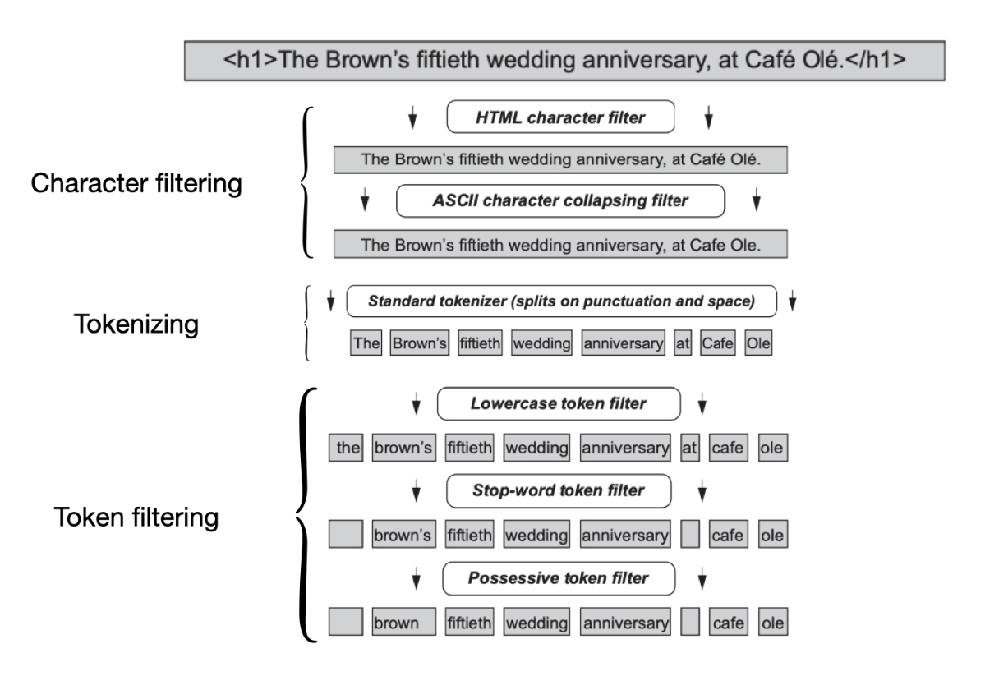
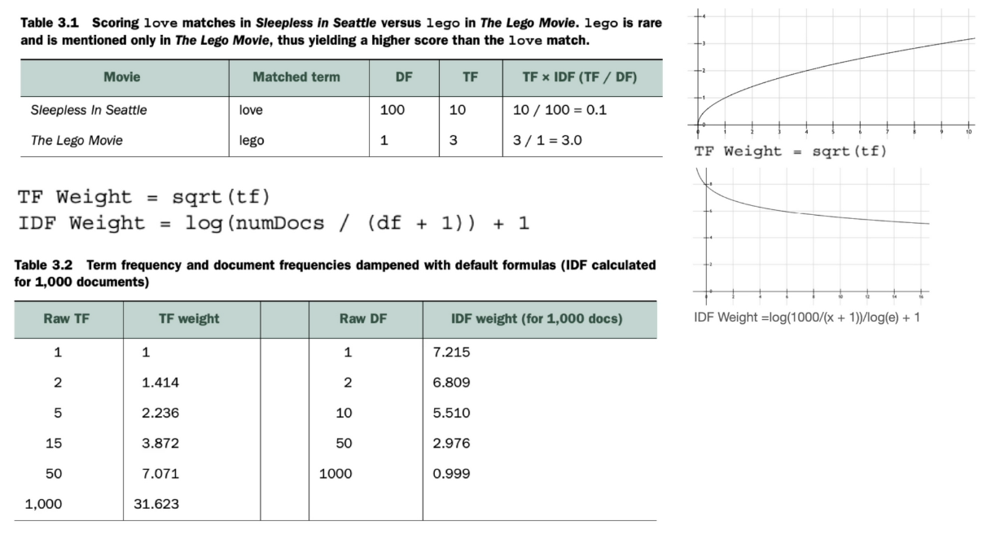
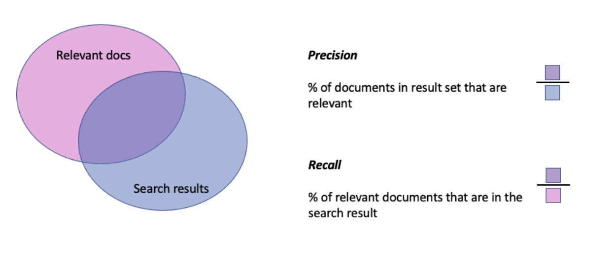
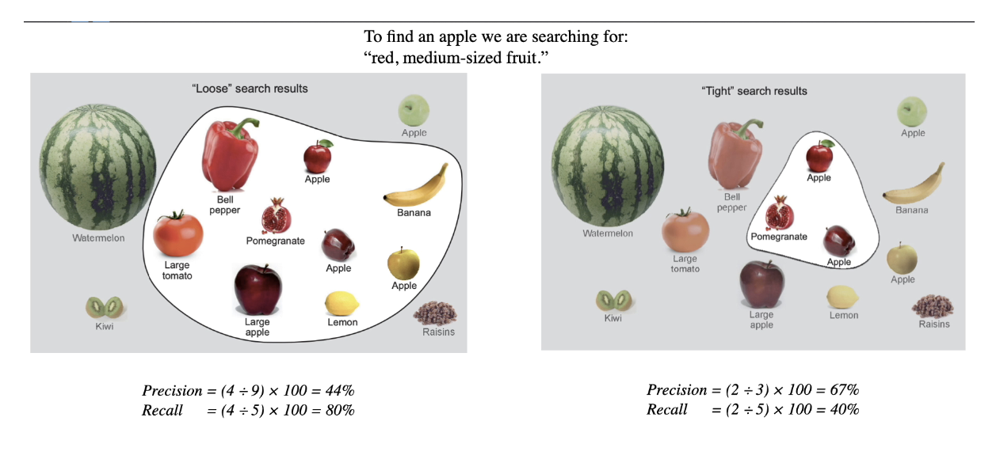

- [What is a relevant search result](#what-is-a-relevant-search-result)
  - [Terms Chapter 1](#terms-chapter-1)
  - [Different kinds of searches](#different-kinds-of-searches)
  - [Information Retrieval](#information-retrieval)
    - [Problems with classic information retrieval](#problems-with-classic-information-retrieval)
  - [The job of a Relevance Engineer](#the-job-of-a-relevance-engineer)
    - [New Definition: Feature](#new-definition-feature)
    - [Features vs Signals](#features-vs-signals)
  - [Collaboration](#collaboration)
- [Search – under the hood](#search--under-the-hood)
  - [Terms Chapter 2](#terms-chapter-2)
    - [Example documents](#example-documents)
  - [Introduction to Search](#introduction-to-search)
    - [Exploring content through search](#exploring-content-through-search)
    - [Getting content into the search engine](#getting-content-into-the-search-engine)
      - [Enrichment](#enrichment)
      - [Analysis](#analysis)
        - [Components of analysis](#components-of-analysis)
          - [Character filtering](#character-filtering)
          - [Tokenization](#tokenization)
          - [Token filtering](#token-filtering)
      - [Indexing](#indexing)
  - [Search engine data structures](#search-engine-data-structures)
    - [The inverted index](#the-inverted-index)
      - [Example documents](#example-documents-1)
      - [Other metadata that can be included in the inverted index](#other-metadata-that-can-be-included-in-the-inverted-index)
        - [Document-specific metadata](#document-specific-metadata)
  - [Document search and retrieval](#document-search-and-retrieval)
    - [Boolean search: AND / OR / NOT](#boolean-search-and--or--not)
    - [Boolean queries in Lucene-based search (MUST / MUST\_NOT / SHOULD)](#boolean-queries-in-lucene-based-search-must--must_not--should)
      - [Lucene query syntax](#lucene-query-syntax)
    - [Positional and phrase matching](#positional-and-phrase-matching)
      - [Further customization](#further-customization)
    - [Enabling exploration: Filtering, facets, and aggregations](#enabling-exploration-filtering-facets-and-aggregations)
    - [Sorting, ranked results, and relevance](#sorting-ranked-results-and-relevance)
    - [Querying ES and debugging](#querying-es-and-debugging)
      - [Example Query: "Basketball with cartoon aliens"](#example-query-basketball-with-cartoon-aliens)
      - [Debugging a query](#debugging-a-query)
        - [ES Analyze API: How does an analyzer tokenize a query text?](#es-analyze-api-how-does-an-analyzer-tokenize-a-query-text)
  - [How relevance of a document is determined](#how-relevance-of-a-document-is-determined)
    - [Field Weight: Classic Similarity function](#field-weight-classic-similarity-function)
      - [The final formula](#the-final-formula)
    - [Query weight](#query-weight)
  - [Tokenizing](#tokenizing)

# What is a relevant search result

## Terms Chapter 1

*Signals*
 : Search-time ranking factors that measure what users care about, such as "How far is the restaurant from me?"

*Information Need*
: A *specification* of the ideal content that would satisfy the user's search

*Relevance*
: Relevance needs to address the *information needs* of the customers in the context of a particular *user experience* while balancing the business needs.

*Feature*
: An attribute of the search content or search query

## Different kinds of searches

- *web search*
  - needs to worry about trustworthiness
  - "Google PageRank" counts number of times site is linked on other sites to prioritize trustworthy results
- *e-com search*
  - controls its own content; trustworthiness is not a concern
  - needs to balance the user's needs with that of the business (clear inventory, maximize margin)
- *expert search*
  - needs to understand the domain jargon
  - users are typically stuck and are looking for a *Eureka* moment – information they couldn't easily find on their own
- many more!

## Information Retrieval

**Information Retrieval** focuses on retrieving information that best satisfies the user's **information need**.

- to discover better text-searching methods, researchers benchmark different strategies using a collection of articles
- these articles are annotated so that search results can be graded
- these annotated lists of search results are called **judgment lists**

Information retrieval focuses on solving search *for a broad set of problems*.

### Problems with classic information retrieval

- focus is broad so it may not solve specific practical problems
- it **doesn't take the business need into account** and only optimizes for the user's information need
- information retrieval only **focuses only on text-relevance** but other non-text information may also be relevant
  - other factors present in the data, e.g. the "PageRank" of a page for Google
  - information about the user and their **user experience**, e.g. their geolocation or to whom the product is being marketed (for a medical search: focus on research or on quick, actionable advice in case of patient complications)
- Information retrieval focuses on optimizing for long text sets which may not be optimal when searching short text snippets

➡ You should optimize specifically for your application and its needs and not just rely on classic information retrieval

➡ It is still useful to also have some text-ranking components from information retrieval in your application

➡ New definition of relevance to include the **user experience** (updated above):

> *Relevance* is the practice of improving search results for users by satisfying *their information needs* in the context of a particular *user experience*, while balancing how ranking *impacts our business needs*.

## The job of a Relevance Engineer

To solve relevance, the relevance engineeer…

1. Identifies salient **features** describing the content, the user, or the search query
2. Finds a way to tell the search engine about those features through extraction and enrichment
3. Crafts **signals** to measure what's relevant to a user's search at search time
4. Build search result ranking functions while carefully balancing the influence of multiple signals

➡ To find relevant results, there is some work that the SE can put in before search time (identify features the user cares about) and then also some query-specific information that is only available at search time. The search result ranking will be a result of both of those inputs.

### New Definition: Feature

*Feature*
: An attribute of the search content or search query

Example: Features of a banana would be that it's yellow and long.

### Features vs Signals

Signals are used to tell the search engine what the engineer thinks is relevant. To determine this, it is using features.

Example: To determine whether a fruit is matching the user's query for a banana, one signal might use the *feature* "color" of a banana to measure *how much a fruit's color corresponds to that of a banana*.  Another signal for a fruit shopper could be how fresh the produce is.

The **ranking function** then combines multiple signals in order to determine relevance.

## Collaboration

Since search engineers do not know what the users want from a search, the user experience or the business needs, it is not possible to make search deliver relevant results alone – cross-functional collaboration is needed to make it work and answer these questions:

- What goals does the user have? (knowledge about user required)
- How can we best curate content, i.e. organize content in such a way that it is easier to find? (knowledge of content and of search engine required)

To further improve relevance, the organization can implement these feedback loops:

- using user behavioral data
- using expert feedback
- creating relevance tests ("Test-driven relevancy practice")

# Search – under the hood

## Terms Chapter 2

Field
: named attribute of a document
: fields are typed, e.g. string, integer, float, boolean
: String fields can be searched

Document
: contains a *set of fields* along with their *values*
: documents are stored in a data store
: within that datastore, documents can contain different fields (unlike a SQL table where every row must have the same information)

Facet
: A dimension by which to aggregate data, e.g. a newspaper section (for newspaper articles)
: Gives relevance feedback to users by showing them how many results are associated with each dimension

Token
: Is a symbol that represents the content of a field in a document
: Elements which are produced during Analysis which reflect the user's query
: Tokens are the dominant **features** used to match a user's query with documents in the index

Inverted Index
: Contains terms and the locations in a document or sets of documents where to find them
: includes a **term dictionary** and a **postings list**
: Also has some meta-information, namely

- document frequency
- term frequency
- term positions
- term offsets
- payloads
- stored fields
- document values

Term dictionary
: A sorted list of all terms that occur *in a given field* across a set of documents

Postings list
: For each term in the term dictionary, lists which documents contain that term

Doc frequency
: A count of documents that contains a particular term
: The length of the postings associated with a particular term
: Gives an indication **how rare a term is** (higher is not necessarily better)
: Is useful in **document scoring** because terms with a very high document frequency will often not be very important

Term frequency
: (for a document)
: The number of times that a term occurs in a particular document
: Gives an indication how important a document is for a given term (the higher the better)

Term positions
: (for a document)
: A list of numbers indicating where a term occurs within a particular document
: Are used to find documents that match a phrase and to distinguish between a search for "dress shoes" and "dress and shoes" for example

Term offsets
: (for a document)
: Lists the start and end character offsets of a search term
: Is used so that highlighting can be inserted between start and end to provide search users with feedback as to why a document has been matched to their query

Payloads
: Attaching additional data to tokens to be used in relevance scoring, e.g. using an externally generated score with a token and using the different scores to rank relevance for different documents

Stored fields
: Fields can be stored in order to present original information back to the user. This is rather data-intensive so most REs avoid storing fields directly in the search engine and instead retrieve them directly from the source system

Doc values
: Auxiliary values which are used for relevance scoring, e.g. high-profit items for an e-com search

### Example documents

0. One shoe, two shoe, the red shoe, the blue shoe
1. The blue dress shoe is the best shoe.
2. The best dress is the one red dress.

Document frequency of "Shoe" = 2 (document 0 and 1)
Term frequency: In Doc 0 [shoe] = 4, in doc 1 [shoe] = 2

## Introduction to Search

### Exploring content through search

A search engine will often include **highlights**, i.e. highlighted snippets of the results which indicate why a document has matched for the user's search so that the user can more easily refine their search in case they did not get a desirable result.

### Getting content into the search engine

We can get data into the search engine via the search ETL pipeline: Extract, Transform, Load

Data is **extracted** from the data warehouse, optionally enriched, then **transformed** into a suitable format for the engine during **analysis**, and then **loaded** into the engine during **indexing**.

#### Enrichment

Enrichment contains these steps:

- *Cleaning* the data (e.g. fixing spelling mistakes, fix duplications)
- *Augmenting* the existing features (e.g. using machine-learning to classify or cluster documents)
- Enhancing data from *external sources* (e.g. with additional product information if it is missing)

#### Analysis

After being loaded into the search engine, fields of a document undergo a process called **analysis** where field values (usually text) are converted into elements called **tokens**.

For example, "running" is turned into "run" and stop words that don't carry any meaning such as "the" or "for" are dropped.

Although the tokens do not have to correspond to words:

- "The Brown's fiftieth wedding anniversary at Café Olé"
  - `The`, `Brown's`, `fiftieth`, `wedding`, `anniversary`, `at`, `Café`, `Olé`
  - `brown`, `fiftieth`, `wedding`, `anniversary`, `cafe`, `ole`
- "location of the White House, 38.8977º N, 77.0366º W
  - tokenized with geohashing: `dqcjqcpee`, `dqcjqcpe`, `dqcjqcp`, `dqcjqc`, `dqcjq`, `dqcj`, `dqc`, `dq`, `d`

Analysis and tokenization occur in two places:

- When storing documents
- When analyzing the user's search query

**Documents with tokens that match the query tokens are considered a match for the search.**

Search engines are dumb – Terms are matched letter by letter, byte for byte:

- "Hose" != "hose"
- "straße" != "straße"
- "c'est" != "cest"

##### Components of analysis

1. Character filtering
  *changes characters*
2. Tokenization
  *turns search term into tokens*
3. Token filtering
  *changes or removes tokens*
  
  

It is possible to store metadata that is generated during analysis with each token, such as *term positions* or *term offsets* which can be used for phrase queries or highlighting, or also add arbitrary metadata in so-called *payloads*. However, these consume a lot of storage and should be avoided if possible.

###### Character filtering

We can use multiple filters after each other.

Examples for filters:

- `HTMLStripCharFilter` which extracts text from HTML
- ASCII character collapsing filter will convert all characters to ASCII, e.g.  `é` to `e`

###### Tokenization

It is **only possible to use one tokenizer** per analysis chain.

- Text is converted into a stream of tokens
- Different tokenizers split on different characters, e.g. the *standard tokenizer* splits on punctuation and whitespace

###### Token filtering

We can use multiple token filters

- tokens can be added, removed or changed
- examples: lowercasing tokens, removing **stop words** such as "the" and "at", removing the possessive form

#### Indexing

After Analysis, the tokens are stored into search engine data structures for document retrieval. In addition to this, the original, untokenized text fields are also stored so that they can presented back to the user in the search results. This is called **indexing**.

Fields are only searchable when they're indexed.

Indexing decisions can affect relevance:

- which pieces of data should be indexed
- which data structures should be used

There is a distinction between *indexing* and *storing* data.

Indexing
: The process of storing data in the search engine
: But also, more specifically: The process of updating the inverted index with the extracted tokens to enable search on that field

Storing
: The process of storing the original, unaltered document content in the stored field's data structure so that it can be used and presented to the user in the search results

For storing, there are two different approaches:

- storing as little additional information as possible, e.g. just a unique ID, and then querying that data from an external source
- storing all data in the search engine directly (to limit external dependencies or for convenience)

## Search engine data structures

### The inverted index

What for a search engine is called an *inverted index* is called just *index* in a book.

The inverted index contains:

- A term dictionary
- A postings list
- can contain some more meta-data in addition, such as data structures for document frequency, term frequency etc.

Term dictionary
: A sorted list of all terms that occur *in a given field* across a set of documents

Postings list
: For each term in the term dictionary, lists which documents contain that term

#### Example documents

0. One shoe, two shoe, the red shoe, the blue shoe
1. The blue dress shoe is the best shoe.
2. The best dress is the one red dress.

The term dictionary for this would look like this:

```text
best  → 0
blue  → 1
dress → 2
is    → 3
one   → 4
red   → 5
shoe  → 6
the   → 7
two   → 8
```

The postings list will look like this:

```text
0 → [1,2]
1 → [0,1]
2 → [1,2]
3 → [1,2]
4 → [0,2]
5 → [0,2]
6 → [0,1]
7 → [0,1,2]
8 → [0]
```

#### Other metadata that can be included in the inverted index

Along with the term dictionary and the postings list, these datastructes can be contained in the inverted index:

Doc frequency
: A count of documents that contains a particular term, or the length of the postings associated with a particular term
: Gives an indication **how rare a term is** (higher is not necessarily better)
: Is useful in **document scoring** because terms with a very high document frequency will often not be very important

##### Document-specific metadata

Term frequency
: The number of times that a term occurs in a particular document
: Gives an indication how important a document is for a given term (the higher the better)

Term positions
: A list of numbers indicating where a term occurs within a particular document
: Are used to find documents that match a phrase and to distinguish between a search for "dress shoes" and "dress and shoes" for example

Term offsets
: Lists the start and end character offsets of a search term
: Is used so that highlighting can be inserted between start and end to provide search users with feedback as to why a document has been matched to their query

Payloads
: Attaching additional data to tokens to be used in relevance scoring, e.g. using an externally generated score with a token and using the different scores to rank relevance for different documents

Stored fields
: Fields can be stored in order to present original information back to the user. This is rather data-intensive so most REs avoid storing fields directly in the search engine and instead retrieve them directly from the source system

Doc values
: Auxiliary values which are used for relevance scoring, e.g. high-profit items for an e-com search

## Document search and retrieval

### Boolean search: AND / OR / NOT

When searching for multiple terms, we can use boolean conditions for the postings of those terms –

- `AND`: both terms should be contained
- `OR`: either term or both should be contained
- `NOT`: a term should not be contained

### Boolean queries in Lucene-based search (MUST / MUST_NOT / SHOULD)

- `MUST`: document must contain a term
- `SHOULD`: document can contain term. Documents containing the term are ranked higher than those that don't
- `MUST_NOT`: document is not considered a match if it contains the term, regardless if it matches a `MUST` or `SHOULD` clause.

#### Lucene query syntax

- `+` for `MUST` clauses
- no sign for `SHOULD` clauses
- `-` for `MUST_NOT` clauses

Example queries:

- `black +cat -dog`
- `+(cat dog) black`: must contain "cat" or "dog" and should contain "black"

Lucene uses these clauses because their "fuzzy" semantics are more suited to search: `black +cat -dog` is much more concise than its equivalent Boolean query, `(cat OR (black AND cat)) AND NOT dog`.

### Positional and phrase matching

A query for "dress shoes" should be different from a query for "dress (and) shoes". The **phrase query** in Lucene takes **term positions** into account. As a result, they can only be used if they are included in the inverted index (as is the default for both Elasticsearch and Solr).

Phrase queries are represented with quotations, e.g. `"dress shoes"`.

Under the hood, Lucene goe sthrough two phases:

1. Find all documents that match every phrase term (`dress` and `shoes`)
2. Remove documents in which the terms aren't adjacent

#### Further customization

- **phrase slop** can be used to adjust the tolerance of how close together the terms need to be
- **span queries** can be used to control term ordering and positioning on a more fine-grained level

### Enabling exploration: Filtering, facets, and aggregations

Showing search facets to a user, along with how many results there are for each facet, gives relevance feedback to the user so that they can filter the results further.

Elasticsearch also offers **aggregations** which enable users to do *online analytical processing (OLAP)* by filtering data , grouping data based on field values and aggregating data (sum, mean, count, min, max etc).

### Sorting, ranked results, and relevance

Relevance is determined by a **ranking function**. It is calculated based on how often a query term occurs in a particular field (the *term frequency* in that field) and is multiplied by a factor based on how common the term is (its *doc frequency* in the collection).
For example, when searching for "back to the future" in a number of documents, the word "the" will likely get a small boost because it is contained in a lot of documents, whereas "future" will get a higher one.
Then, term scores within a field are combined. So a document field, e.g., "title", matching `back` and `future` will be scored higher than one document title contained only one of them.

On top of this, **numerical boosts** can be applied to reflect how important each field should be.

### Querying ES and debugging

#### Example Query: "Basketball with cartoon aliens"

```request
GET http://localhost:9200/tmdb/_search
```

```json
{
    "query": {
        "multi_match": {
            "query": "basketball with cartoon aliens",
            "fields": ["title^10", "overview"]
        }
    },
    "explain": true
}
```

Top results from response (parsed from response JSON with python)

```
Num RelevanceScore Movie Title
1 85.57  Aliens
2 73.71  The Basketball Diaries
3 71.32  Cowboys & Aliens
4 61.14  Monsters vs Aliens
5 53.5  Aliens vs Predator: Requiem
6 53.5  Aliens in the Attic
7 45.22  Dances with Wolves
8 45.22  Friends with Benefits
9 45.22  Fire with Fire
10 45.22  Friends with Kids
```

#### Debugging a query

##### ES Analyze API: How does an analyzer tokenize a query text?

Since we did not specify an analyzer to use in our previous query, ES uses the **standard analyzer**. We can look at how this tokenizes a query text by making a call using the ES Analyze API.

```request
GET http://localhost:9200/tmdb/tmdb/_analyze
```

```json
{
    "analyzer": "standard",
    "text": "Fire with Fire"
}
```

Response

```json
{
    "tokens": [
        {
            "token": "fire",
            "start_offset": 0,
            "end_offset": 4,
            "type": "<ALPHANUM>",
            "position": 0
        },
        {
            "token": "with",
            "start_offset": 5,
            "end_offset": 9,
            "type": "<ALPHANUM>",
            "position": 1
        },
        {
            "token": "fire",
            "start_offset": 10,
            "end_offset": 14,
            "type": "<ALPHANUM>",
            "position": 2
        }
    ]
}
```

## How relevance of a document is determined

### Field Weight: Classic Similarity function

$$
TF \cdot IDF = TF \cdot \frac{1}{DF} = \frac{TF}{DF}
$$

*[TF]: Term frequency
*[IDF]: Inverse Document Frequency
*[DF]: Document Frequency

TF : Term frequency,
IDF: Inverse Document Frequency

**Conclusion** the relevance of a document regarding a search term will be higher if not many documents in our database match.

We can dampen the relevance of each by applying a formula to them:

  

#### The final formula

"Classic Similarity" is an algorithm to determine relevance. It is computed as  follows:

$$
\text{Classic Similarity} = TF_{\text{weighted}} \cdot IDF_{\text{weighted}} \cdot \text{fieldNorm}
$$

If we want to take into account how much text is within a field, and want to give those documents a higher ranking where  the  term occurs within a smaller text, we need tot take into account the field norm. The field norm is defined as

$$
\text{fieldNorm} = \frac{1}{\sqrt{\text{fieldLength}}}
$$

If we're looking for the term "alien" in the title field of a movie, the movie "Alien" will have a fieldNorm of 1 since fieldLength is 1.

So relevance is weighted TF divided by weighted DF times the square root of the field length:

$$
\text{Classic Similarity} = \frac{TF_{\text{weighted}}}{DF_{\text{weighted}} \cdot \sqrt{\text{fieldLength}}}
$$

### Query weight

$$
\text{queryNorm} \cdot IDF
$$

What is the queryNorm?

## Tokenizing

- *Precision*: The percentage of documents in the result set that are relevant
- *Recall*: The percentage of relevant documents that are returned in the result set



  

Usually, we have to sacrifice either of these to improve the other: To improve precision, we're going to have to sacrifice recall. Otherwise, we have to include more features, f.ex. looking for sweet fruits in this example. Then, the tomato would be excluded.
