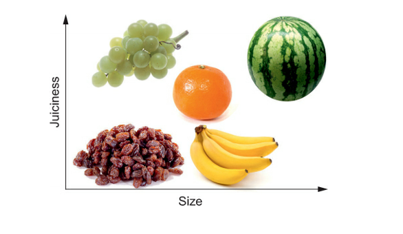
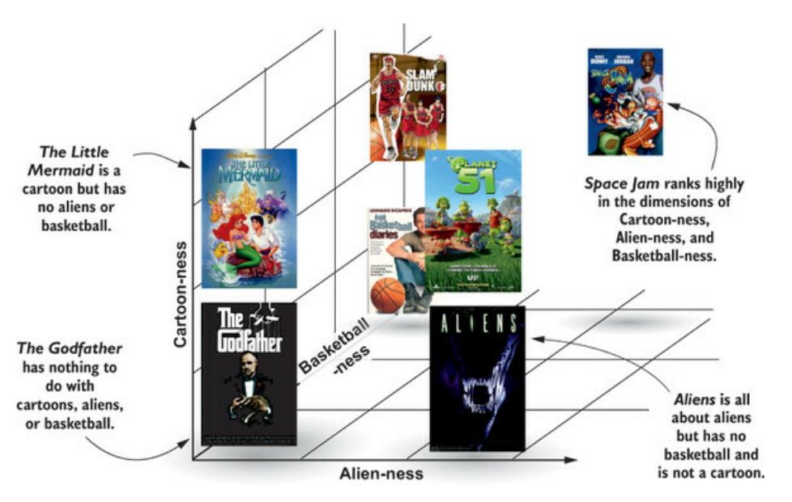
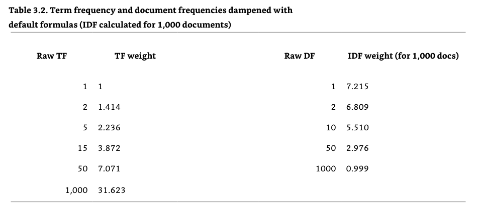

- [Chapter 1: What is a relevant search result](#chapter-1-what-is-a-relevant-search-result)
  - [Terms Chapter 1](#terms-chapter-1)
  - [Different kinds of searches](#different-kinds-of-searches)
  - [Information Retrieval](#information-retrieval)
    - [Problems with classic information retrieval](#problems-with-classic-information-retrieval)
  - [The job of a Relevance Engineer](#the-job-of-a-relevance-engineer)
    - [New Definition: Feature](#new-definition-feature)
    - [Features vs Signals](#features-vs-signals)
  - [Collaboration](#collaboration)
- [Chapter 2: Search - under the hood](#chapter-2-search---under-the-hood)
  - [Terms Chapter 2](#terms-chapter-2)
    - [Example documents](#example-documents)
  - [Introduction to Search](#introduction-to-search)
    - [Exploring content through search](#exploring-content-through-search)
    - [Getting content into the search engine](#getting-content-into-the-search-engine)
      - [Enrichment](#enrichment)
      - [Analysis](#analysis)
        - [Components of analysis](#components-of-analysis)
          - [Character filtering](#character-filtering)
          - [Tokenization](#tokenization)
          - [Token filtering](#token-filtering)
      - [Indexing](#indexing)
  - [Search engine data structures](#search-engine-data-structures)
    - [The inverted index](#the-inverted-index)
      - [Example documents](#example-documents-1)
      - [Other metadata that can be included in the inverted index](#other-metadata-that-can-be-included-in-the-inverted-index)
        - [Document-specific metadata](#document-specific-metadata)
  - [Document search and retrieval](#document-search-and-retrieval)
    - [Boolean search: AND / OR / NOT](#boolean-search-and--or--not)
    - [Boolean queries in Lucene-based search (MUST / MUST\_NOT / SHOULD)](#boolean-queries-in-lucene-based-search-must--must_not--should)
      - [Lucene query syntax](#lucene-query-syntax)
    - [Positional and phrase matching](#positional-and-phrase-matching)
      - [Further customization](#further-customization)
    - [Enabling exploration: Filtering, facets, and aggregations](#enabling-exploration-filtering-facets-and-aggregations)
    - [Sorting, ranked results, and relevance](#sorting-ranked-results-and-relevance)
- [Chapter 3: Debugging your first relevance problem](#chapter-3-debugging-your-first-relevance-problem)
  - [Example Query: "Basketball with cartoon aliens"](#example-query-basketball-with-cartoon-aliens)
  - [Debugging a query](#debugging-a-query)
    - [ES Validate API: Examining the underlying query strategy](#es-validate-api-examining-the-underlying-query-strategy)
    - [ES Analyze API: How does an analyzer tokenize a query text?](#es-analyze-api-how-does-an-analyzer-tokenize-a-query-text)
    - [Comparing your query to the inverted index](#comparing-your-query-to-the-inverted-index)
    - [Specifying an analyzer](#specifying-an-analyzer)
  - [Debugging ranking](#debugging-ranking)
    - [Using `"explain": true` for a search query](#using-explain-true-for-a-search-query)
    - [Examining relevance scores](#examining-relevance-scores)
  - [The vector-space model, the relevance explain, and you](#the-vector-space-model-the-relevance-explain-and-you)
    - [Similarity as the dot product between two vectors](#similarity-as-the-dot-product-between-two-vectors)
    - [Caveats to the vector space model](#caveats-to-the-vector-space-model)
  - [Scoring matches to measure relevance](#scoring-matches-to-measure-relevance)
  - [How relevance of a document is determined](#how-relevance-of-a-document-is-determined)
    - [Field Weight: Classic Similarity function](#field-weight-classic-similarity-function)
      - [Dampened similarity](#dampened-similarity)
      - [Field norm](#field-norm)
      - [The final formula](#the-final-formula)
    - [Okapi BM25](#okapi-bm25)
    - [Query weight](#query-weight)
  - [Fixing our ranking for "Space Jam" vs. "Alien"](#fixing-our-ranking-for-space-jam-vs-alien)
  - [Solved? Our work is never over](#solved-our-work-is-never-over)
- [Chapter 4: Taming tokens](#chapter-4-taming-tokens)
  - [Tokenizing](#tokenizing)

# Chapter 1: What is a relevant search result

## Terms Chapter 1

*Signals*
 : Search-time ranking factors that measure what users care about, such as "How far is the restaurant from me?"

*Information Need*
: A *specification* of the ideal content that would satisfy the user's search

*Relevance*
: Relevance needs to address the *information needs* of the customers in the context of a particular *user experience* while balancing the business needs.

*Feature*
: An attribute of the search content or search query

## Different kinds of searches

- *web search*
  - needs to worry about trustworthiness
  - "Google PageRank" counts number of times site is linked on other sites to prioritize trustworthy results
- *e-com search*
  - controls its own content; trustworthiness is not a concern
  - needs to balance the user's needs with that of the business (clear inventory, maximize margin)
- *expert search*
  - needs to understand the domain jargon
  - users are typically stuck and are looking for a *Eureka* moment – information they couldn't easily find on their own
- many more!

## Information Retrieval

**Information Retrieval** focuses on retrieving information that best satisfies the user's **information need**.

- to discover better text-searching methods, researchers benchmark different strategies using a collection of articles
- these articles are annotated so that search results can be graded
- these annotated lists of search results are called **judgment lists**

Information retrieval focuses on solving search *for a broad set of problems*.

### Problems with classic information retrieval

- focus is broad so it may not solve specific practical problems
- it **doesn't take the business need into account** and only optimizes for the user's information need
- information retrieval only **focuses only on text-relevance** but other non-text information may also be relevant
  - other factors present in the data, e.g. the "PageRank" of a page for Google
  - information about the user and their **user experience**, e.g. their geolocation or to whom the product is being marketed (for a medical search: focus on research or on quick, actionable advice in case of patient complications)
- Information retrieval focuses on optimizing for long text sets which may not be optimal when searching short text snippets

➡ You should optimize specifically for your application and its needs and not just rely on classic information retrieval

➡ It is still useful to also have some text-ranking components from information retrieval in your application

➡ New definition of relevance to include the **user experience** (updated above):

> *Relevance* is the practice of improving search results for users by satisfying *their information needs* in the context of a particular *user experience*, while balancing how ranking *impacts our business needs*.

## The job of a Relevance Engineer

To solve relevance, the relevance engineeer…

1. Identifies salient **features** describing the content, the user, or the search query
2. Finds a way to tell the search engine about those features through extraction and enrichment
3. Crafts **signals** to measure what's relevant to a user's search at search time
4. Build search result ranking functions while carefully balancing the influence of multiple signals

➡ To find relevant results, there is some work that the SE can put in before search time (identify features the user cares about) and then also some query-specific information that is only available at search time. The search result ranking will be a result of both of those inputs.

### New Definition: Feature

*Feature*
: An attribute of the search content or search query

Example: Features of a banana would be that it's yellow and long.

### Features vs Signals

Signals are used to tell the search engine what the engineer thinks is relevant. To determine this, it is using features.

Example: To determine whether a fruit is matching the user's query for a banana, one signal might use the *feature* "color" of a banana to measure *how much a fruit's color corresponds to that of a banana*.  Another signal for a fruit shopper could be how fresh the produce is.

The **ranking function** then combines multiple signals in order to determine relevance.

## Collaboration

Since search engineers do not know what the users want from a search, the user experience or the business needs, it is not possible to make search deliver relevant results alone – cross-functional collaboration is needed to make it work and answer these questions:

- What goals does the user have? (knowledge about user required)
- How can we best curate content, i.e. organize content in such a way that it is easier to find? (knowledge of content and of search engine required)

To further improve relevance, the organization can implement these feedback loops:

- using user behavioral data
- using expert feedback
- creating relevance tests ("Test-driven relevancy practice")

# Chapter 2: Search - under the hood

## Terms Chapter 2

Field
: named attribute of a document
: fields are typed, e.g. string, integer, float, boolean
: String fields can be searched

Document
: contains a *set of fields* along with their *values*
: documents are stored in a data store
: within that datastore, documents can contain different fields (unlike a SQL table where every row must have the same information)

Facet
: A dimension by which to aggregate data, e.g. a newspaper section (for newspaper articles)
: Gives relevance feedback to users by showing them how many results are associated with each dimension

Token
: Is a symbol that represents the content of a field in a document
: Elements which are produced during Analysis which reflect the user's query
: Tokens are the dominant **features** used to match a user's query with documents in the index

Inverted Index
: Contains terms and the locations in a document or sets of documents where to find them
: includes a **term dictionary** and a **postings list**
: Also has some meta-information, namely

- document frequency
- term frequency
- term positions
- term offsets
- payloads
- stored fields
- document values

Term dictionary
: A sorted list of all terms that occur *in a given field* across a set of documents

Postings list
: For each term in the term dictionary, lists which documents contain that term

Doc frequency
: A count of documents that contains a particular term
: The length of the postings associated with a particular term
: Gives an indication **how rare a term is** (higher is not necessarily better)
: Is useful in **document scoring** because terms with a very high document frequency will often not be very important

Term frequency
: (for a document)
: The number of times that a term occurs in a particular document
: Gives an indication how important a document is for a given term (the higher the better)

Term positions
: (for a document)
: A list of numbers indicating where a term occurs within a particular document
: Are used to find documents that match a phrase and to distinguish between a search for "dress shoes" and "dress and shoes" for example

Term offsets
: (for a document)
: Lists the start and end character offsets of a search term
: Is used so that highlighting can be inserted between start and end to provide search users with feedback as to why a document has been matched to their query

Payloads
: Attaching additional data to tokens to be used in relevance scoring, e.g. using an externally generated score with a token and using the different scores to rank relevance for different documents

Stored fields
: Fields can be stored in order to present original information back to the user. This is rather data-intensive so most REs avoid storing fields directly in the search engine and instead retrieve them directly from the source system

Doc values
: Auxiliary values which are used for relevance scoring, e.g. high-profit items for an e-com search

### Example documents

0. One shoe, two shoe, the red shoe, the blue shoe
1. The blue dress shoe is the best shoe.
2. The best dress is the one red dress.

Document frequency of "Shoe" = 2 (document 0 and 1)
Term frequency: In Doc 0 [shoe] = 4, in doc 1 [shoe] = 2

## Introduction to Search

### Exploring content through search

A search engine will often include **highlights**, i.e. highlighted snippets of the results which indicate why a document has matched for the user's search so that the user can more easily refine their search in case they did not get a desirable result.

### Getting content into the search engine

We can get data into the search engine via the search ETL pipeline: Extract, Transform, Load

Data is **extracted** from the data warehouse, optionally enriched, then **transformed** into a suitable format for the engine during **analysis**, and then **loaded** into the engine during **indexing**.

#### Enrichment

Enrichment contains these steps:

- *Cleaning* the data (e.g. fixing spelling mistakes, fix duplications)
- *Augmenting* the existing features (e.g. using machine-learning to classify or cluster documents)
- Enhancing data from *external sources* (e.g. with additional product information if it is missing)

#### Analysis

After being loaded into the search engine, fields of a document undergo a process called **analysis** where field values (usually text) are converted into elements called **tokens**.

For example, "running" is turned into "run" and stop words that don't carry any meaning such as "the" or "for" are dropped.

Although the tokens do not have to correspond to words:

- "The Brown's fiftieth wedding anniversary at Café Olé"
  - `The`, `Brown's`, `fiftieth`, `wedding`, `anniversary`, `at`, `Café`, `Olé`
  - `brown`, `fiftieth`, `wedding`, `anniversary`, `cafe`, `ole`
- "location of the White House, 38.8977º N, 77.0366º W
  - tokenized with geohashing: `dqcjqcpee`, `dqcjqcpe`, `dqcjqcp`, `dqcjqc`, `dqcjq`, `dqcj`, `dqc`, `dq`, `d`

Analysis and tokenization occur in two places:

- When storing documents
- When analyzing the user's search query

**Documents with tokens that match the query tokens are considered a match for the search.**

Search engines are dumb – Terms are matched letter by letter, byte for byte:

- "Hose" != "hose"
- "straße" != "straße"
- "c'est" != "cest"

##### Components of analysis

1. Character filtering
  *changes characters*
2. Tokenization
  *turns search term into tokens*
3. Token filtering
  *changes or removes tokens*
  
  

It is possible to store metadata that is generated during analysis with each token, such as *term positions* or *term offsets* which can be used for phrase queries or highlighting, or also add arbitrary metadata in so-called *payloads*. However, these consume a lot of storage and should be avoided if possible.

###### Character filtering

We can use multiple filters after each other.

Examples for filters:

- `HTMLStripCharFilter` which extracts text from HTML
- ASCII character collapsing filter will convert all characters to ASCII, e.g.  `é` to `e`

###### Tokenization

It is **only possible to use one tokenizer** per analysis chain.

- Text is converted into a stream of tokens
- Different tokenizers split on different characters, e.g. the *standard tokenizer* splits on punctuation and whitespace

###### Token filtering

We can use multiple token filters

- tokens can be added, removed or changed
- examples: lowercasing tokens, removing **stop words** such as "the" and "at", removing the possessive form

#### Indexing

After Analysis, the tokens are stored into search engine data structures for document retrieval. In addition to this, the original, untokenized text fields are also stored so that they can presented back to the user in the search results. This is called **indexing**.

Fields are only searchable when they're indexed.

Indexing decisions can affect relevance:

- which pieces of data should be indexed
- which data structures should be used

There is a distinction between *indexing* and *storing* data.

Indexing
: The process of storing data in the search engine
: But also, more specifically: The process of updating the inverted index with the extracted tokens to enable search on that field

Storing
: The process of storing the original, unaltered document content in the stored field's data structure so that it can be used and presented to the user in the search results

For storing, there are two different approaches:

- storing as little additional information as possible, e.g. just a unique ID, and then querying that data from an external source
- storing all data in the search engine directly (to limit external dependencies or for convenience)

## Search engine data structures

### The inverted index

What for a search engine is called an *inverted index* is called just *index* in a book.

The inverted index contains:

- A term dictionary
- A postings list
- can contain some more meta-data in addition, such as data structures for document frequency, term frequency etc.

Term dictionary
: A sorted list of all terms that occur *in a given field* across a set of documents

Postings list
: For each term in the term dictionary, lists which documents contain that term

#### Example documents

0. One shoe, two shoe, the red shoe, the blue shoe
1. The blue dress shoe is the best shoe.
2. The best dress is the one red dress.

The term dictionary for this would look like this:

```text
best  → 0
blue  → 1
dress → 2
is    → 3
one   → 4
red   → 5
shoe  → 6
the   → 7
two   → 8
```

The postings list will look like this:

```text
0 → [1,2]
1 → [0,1]
2 → [1,2]
3 → [1,2]
4 → [0,2]
5 → [0,2]
6 → [0,1]
7 → [0,1,2]
8 → [0]
```

#### Other metadata that can be included in the inverted index

Along with the term dictionary and the postings list, these datastructes can be contained in the inverted index:

Doc frequency
: A count of documents that contains a particular term, or the length of the postings associated with a particular term
: Gives an indication **how rare a term is** (higher is not necessarily better)
: Is useful in **document scoring** because terms with a very high document frequency will often not be very important

##### Document-specific metadata

Term frequency
: The number of times that a term occurs in a particular document
: Gives an indication how important a document is for a given term (the higher the better)

Term positions
: A list of numbers indicating where a term occurs within a particular document
: Are used to find documents that match a phrase and to distinguish between a search for "dress shoes" and "dress and shoes" for example

Term offsets
: Lists the start and end character offsets of a search term
: Is used so that highlighting can be inserted between start and end to provide search users with feedback as to why a document has been matched to their query

Payloads
: Attaching additional data to tokens to be used in relevance scoring, e.g. using an externally generated score with a token and using the different scores to rank relevance for different documents

Stored fields
: Fields can be stored in order to present original information back to the user. This is rather data-intensive so most REs avoid storing fields directly in the search engine and instead retrieve them directly from the source system

Doc values
: Auxiliary values which are used for relevance scoring, e.g. high-profit items for an e-com search

## Document search and retrieval

### Boolean search: AND / OR / NOT

When searching for multiple terms, we can use boolean conditions for the postings of those terms –

- `AND`: both terms should be contained
- `OR`: either term or both should be contained
- `NOT`: a term should not be contained

### Boolean queries in Lucene-based search (MUST / MUST_NOT / SHOULD)

- `MUST`: document must contain a term
- `SHOULD`: document can contain term. Documents containing the term are ranked higher than those that don't
- `MUST_NOT`: document is not considered a match if it contains the term, regardless if it matches a `MUST` or `SHOULD` clause.

#### Lucene query syntax

- `+` for `MUST` clauses
- no sign for `SHOULD` clauses
- `-` for `MUST_NOT` clauses

Example queries:

- `black +cat -dog`
- `+(cat dog) black`: must contain "cat" or "dog" and should contain "black"

Lucene uses these clauses because their "fuzzy" semantics are more suited to search: `black +cat -dog` is much more concise than its equivalent Boolean query, `(cat OR (black AND cat)) AND NOT dog`.

### Positional and phrase matching

A query for "dress shoes" should be different from a query for "dress (and) shoes". The **phrase query** in Lucene takes **term positions** into account. As a result, they can only be used if they are included in the inverted index (as is the default for both Elasticsearch and Solr).

Phrase queries are represented with quotations, e.g. `"dress shoes"`.

Under the hood, Lucene goe sthrough two phases:

1. Find all documents that match every phrase term (`dress` and `shoes`)
2. Remove documents in which the terms aren't adjacent

#### Further customization

- **phrase slop** can be used to adjust the tolerance of how close together the terms need to be
- **span queries** can be used to control term ordering and positioning on a more fine-grained level

### Enabling exploration: Filtering, facets, and aggregations

Showing search facets to a user, along with how many results there are for each facet, gives relevance feedback to the user so that they can filter the results further.

Elasticsearch also offers **aggregations** which enable users to do *online analytical processing (OLAP)* by filtering data , grouping data based on field values and aggregating data (sum, mean, count, min, max etc).

### Sorting, ranked results, and relevance

Relevance is determined by a **ranking function**. It is calculated based on how often a query term occurs in a particular field (the *term frequency* in that field) and is multiplied by a factor based on how common the term is (its *doc frequency* in the collection).
For example, when searching for "back to the future" in a number of documents, the word "the" will likely get a small boost because it is contained in a lot of documents, whereas "future" will get a higher one.
Then, term scores within a field are combined. So a document field, e.g., "title", matching `back` and `future` will be scored higher than one document title contained only one of them.

On top of this, **numerical boosts** can be applied to reflect how important each field should be.

# Chapter 3: Debugging your first relevance problem

## Example Query: "Basketball with cartoon aliens"

```request
GET http://localhost:9200/tmdb/_search
```

```json
{
    "query": {
        "multi_match": {
            "query": "basketball with cartoon aliens",
            "fields": ["title^10", "overview"]
        }
    }
}
```

Top results from response (parsed from response JSON with python) – *Space Jam* is not contained in top 15 results.

| Num | Relevance Score | Movie Title                 |
| :-- | :-------------- | :-------------------------- |
| 1   | 85.6            | Aliens                      |
| 2   | 73.7            | The Basketball Diaries      |
| 3   | 71.3            | Cowboys & Aliens            |
| 4   | 61.1            | Monsters vs Aliens          |
| 5   | 53.5            | Aliens vs Predator: Requiem |
| 6   | 53.5            | Aliens in the Attic         |
| 7   | 45.2            | Dances with Wolves          |
| 8   | 45.2            | Friends with Benefits       |
| 9   | 45.2            | Fire with Fire              |
| 10  | 45.2            | Friends with Kids           |
| 11  | 39.6            | Interview with the Vampire  |
| 12  | 39.6            | From Russia With Love       |
| 13  | 39.6            | Gone with the Wind          |
| 14  | 39.6            | Just Go With It             |
| 15  | 39.6            | My Week with Marilyn        |

## Debugging a query

The matching behavior consists of two parts:

- **Query parsing** – how the Query DSL query translates into a matching strategy of specific terms to fields\
  Understand how the Query DSL uses Lucene's data structures to answer your search query against different fields.
- **Analysis** – The process of *creating tokens* from 1) the query or 2) the document text\
  Try out different analysis components so that documents that should match also do match

### ES Validate API: Examining the underlying query strategy

Here, we're asking ES to explain to us how our query was parsed so that we can make sure that we formulated the query correctly. We are sending the same query to this endpoint as we previously did to the `_search` endpoint.

```request
GET http://localhost:9200/tmdb/_validate/query?explain
```

```json
{
    "query": {
        "multi_match": {
            "query": "basketball with cartoon aliens",
            "fields": ["title^10", "overview"]
        }
    }
}
```

Response:

```json
{
  "_shards": {
    "total": 1,
    "successful": 1,
    "failed": 0
  },
  "valid": true,
  "explanations": [
    {
      "index": "tmdb",
      "valid": true,
      "explanation": "((title:basketball title:with title:cartoon title:aliens)^10.0 | (overview:basketball overview:with overview:cartoon overview:aliens))"
    }
  ]
}
```

The notation in the `explanation` field in the repsonse follows this format:

- `<fieldname>:<query>`, so `title:with` means that Lucene was looking for the word "with" in the `title` field. This already points us to the first problem – words not carrying any meaning such as "with" should be excluded from the query
- The `^10` signifies that the title fields should be boosted by a factor of 10
- The `|` operator tells us that Lucene will take the maximum of either score

There are different types of queries, two of them being the most prominent:

- **term query** – simple term is looked up in the inverted index.\
  Notation: `<fieldname>:<term>`, e.g. `title:with`
- **phrase query** – terms that should be adjacent are looked up in the invertex index.\
  Notation: `fieldname>:"<term1> <term2> <...> <term_n>"`, e.g. `title:"space jam"`

### ES Analyze API: How does an analyzer tokenize a query text?

Analyzers contain three components as mentioned in Chapter 2:

- character filter
- tokenizer
- token filter

Since we did not specify an analyzer to use in our previous query, ES uses the **standard analyzer**. We can look at how this tokenizes a query text by making a call using the ES Analyze API.

```request
GET http://localhost:9200/tmdb/_analyze
```

```json
{
    "analyzer": "standard",
    "text": "Fire with Fire"
}
```

Response

```json
{
    "tokens": [
        {
            "token": "fire",
            "start_offset": 0,
            "end_offset": 4,
            "type": "<ALPHANUM>",
            "position": 0
        },
        {
            "token": "with",
            "start_offset": 5,
            "end_offset": 9,
            "type": "<ALPHANUM>",
            "position": 1
        },
        {
            "token": "fire",
            "start_offset": 10,
            "end_offset": 14,
            "type": "<ALPHANUM>",
            "position": 2
        }
    ]
}
```

After analysis, the token stream is indexed and placed into the inverted index. This is what a "SimpleText" representation of the inverted index looks like for the terms "fire" and "with:

```txt
field title
  term fire
    doc 0
      freq 2
      position 1
      position 3
    doc 2
      ...
  term with
    doc 0
      freq 1
      position 2
```

### Comparing your query to the inverted index

We can now compare our parsed query against the inverted index.

- parsed query: `((title:basketball title:with title:cartoon title:aliens)^10.0 | (overview:basketball overview:with overview:cartoon overview:aliens))` (from the `_validate` endpoint)
- inverted index: see above

Since the movie *"Fire with Fire"* matches the *"with"* part of the query *"basketball with cartoon aliens"*, it is listed as a result.

Any search results that match but should not match are called **spurious results**. We can spot some other spurious results that contain the word "with". We can now specify an analyzer that removes stop words such as "with" to get better results that we can use instead of the standard analyzer.

### Specifying an analyzer

The analyzer that is used can be specified at many levels:

- for the whole index
- a node, i.e. a running instance of Elasticsearch
- a field
- at query time for a specific query

If we now want to apply a new analyzer to our index, we'll have to **re-index our documents** since we need to alter the structure of the inverted index so that stop words are ignored and not listed.

Now we can delete our old index and create a new one with the following settings which tell ES to use the English analyzer for the title and overview fields.

```txt
PUT http://localhost:9200/tmdb
```

```json
{
    "settings": {
        "number_of_shards": 1,
        "index": {
            "analysis": {}
        }
    },
    "mappings": {
        "properties": {
            "title": {
                "type": "text",
                "analyzer": "english"
            },
            "overview": {
                "type": "text",
                "analyzer": "english"
            }
        }
    }
}
```

Finally, we can re-upload the movies contained in tmdb.json to the index (see `reindex` function in python notebook).

When we re-query the `_analyze` endpoint, we get the following tokens:

```request
GET http://localhost:9200/tmdb/_analyze
```

```json
{
    "field": "title",
    "text": "Fire with Fire"
}
```

The token "with" is now no longer listed. We can see in the gap in positions between the first listing of fire (`0`) and the second listing of fire (`2`) that the word is still contained in the title.

```json
{
  "tokens": [
    {
      "token": "fire",
      "start_offset": 0,
      "end_offset": 4,
      "type": "<ALPHANUM>",
      "position": 0
    },
    {
      "token": "fire",
      "start_offset": 10,
      "end_offset": 14,
      "type": "<ALPHANUM>",
      "position": 2
    }
  ]
}
```

If we call the `_validate` endpoint again for the query "basketball with cartoon aliens", we can see that the word "with" is now removed from the tokens for title and overview:

```request
GET http://localhost:9200/tmdb/_validate/query?explain
```

```json
{
    "query": {
        "multi_match": {
            "query": "basketball with cartoon aliens",
            "fields": ["title^10", "overview"]
        }
    }
}
```

```json
{
  "_shards": {
    "total": 1,
    "successful": 1,
    "failed": 0
  },
  "valid": true,
  "explanations": [
    {
      "index": "tmdb",
      "valid": true,
      "explanation": "((title:basketbal title:cartoon title:alien)^10.0 | (overview:basketbal overview:cartoon overview:alien))"
    }
  ]
}
```

When we search again, we can see that *Space Jam* is now at position 11 (results parsed with python):

| Num | RelevanceScore | Movie Title                 |
| :-- | :------------- | :-------------------------- |
| 1   | 78.8           | The Basketball Diaries      |
| 2   | 74.1           | Alien                       |
| 3   | 74.1           | Aliens                      |
| 4   | 74.1           | Alien³                      |
| 5   | 59.7           | Cowboys & Aliens            |
| 6   | 59.7           | Aliens in the Attic         |
| 7   | 59.7           | Alien: Resurrection         |
| 8   | 50.0           | Monsters vs Aliens          |
| 9   | 43.0           | Aliens vs Predator: Requiem |
| 10  | 43.0           | AVP: Alien vs. Predator     |
| 11  | 12.9           | **Space Jam** ⭐️          |
| 12  | 7.5            | Grown Ups                   |
| 13  | 7.5            | Speed Racer                 |
| 14  | 7.2            | Semi-Pro                    |
| 15  | 7.2            | The Flintstones             |

## Debugging ranking

To understand ranking, we need to understand these two things:

- how **individual match scores** are calculated
- how these factor into the **document's overall relevance score**

### Using `"explain": true` for a search query

We can issue the same search as before with the additional field "explain" set to `true`:

```request
GET http://localhost:9200/tmdb/_search
```

```json
{
    "query": {
        "multi_match": {
            "query": "basketball with cartoon aliens",
            "fields": ["title^10", "overview"]
        }
    },
    "explain": true,
}
```

### Examining relevance scores

If we look at the first result's `_explanation` field, we can see how its relevance score is being calculated. The resulting json is quite large, so what follows is shortened with some child nodes having been replaced by `...`.

```json
{
  "value": 78.76023,
  "description": "max of:",
  "details": [
    {
      "value": 78.76023,
      "description": "sum of:",
      "details": [
        {
          "value": 78.76023,
          "description": "weight(title:basketbal in 784) [PerFieldSimilarity], result of:",
          "details": [
            {
              "value": 78.76023,
              "description": "score(freq=1.0), computed as boost * idf * tf from:",
              "details": [
                {
                  "value": 22,
                  "description": "boost",
                  "details": []
                },
                {
                  "value": 7.6180873,
                  "description": "idf, computed as log(1 + (N - n + 0.5) / (n + 0.5)) from:",
                  "details": [...]
                },
                {
                  "value": 0.4699356,
                  "description": "tf, computed as freq / (freq + k1 * (1 - b + b * dl / avgdl)) from:",
                  "details": [...]
                }
              ]
            }
          ]
        }
      ]
    }
  ]
}
```

Here is a prettier and full version of this (for code see Jupyter notebook):

```txt
title: The Basketball Diaries
└──78.76023 (max of:)
   └──78.76023 (sum of:)
      └──78.76023 (weight(title:basketbal in 784) [PerFieldSimilarity], result of:)
         └──78.76023 (score(freq=1.0), computed as boost * idf * tf from:)
            └──22.0 (boost)
            └──7.6180873 (idf, computed as log(1 + (N - n + 0.5) / (n + 0.5)) from:)
               └──1 (n, number of documents containing term)
               └──3051 (N, total number of documents with field)
            └──0.4699356 (tf, computed as freq / (freq + k1 * (1 - b + b * dl / avgdl)) from:)
               └──1.0 (freq, occurrences of term within document)
               └──1.2 (k1, term saturation parameter)
               └──0.75 (b, length normalization parameter)
               └──2.0 (dl, length of field)
               └──2.1740413 (avgdl, average length of field)
```

For *Space Jam*, the score calculation can be seen below. We have boosted the title field by ten and so *The Basketball Diaries* gets a big relevance boost since it contains one of the query terms in the title. *Space Jam* only contains `basketbal` (the stemmed form of "basketball") in the overview field, so it gets a smaller boost. There is also apparently only one document with "basketball" in the title, whereas there are eight documents with "basketball" in the overview field.

```txt
title: Space Jam
└──12.882349 (max of:)
   └──12.882349 (sum of:)
      └──7.8759747 (weight(overview:basketbal in 795) [PerFieldSimilarity], result of:)
         └──7.8759747 (score(freq=1.0), computed as boost * idf * tf from:)
            └──2.2 (boost)
            └──5.8831587 (idf, computed as log(1 + (N - n + 0.5) / (n + 0.5)) from:)
               └──8 (n, number of documents containing term)
               └──3050 (N, total number of documents with field)
            └──0.60851467 (tf, computed as freq / (freq + k1 * (1 - b + b * dl / avgdl)) from:)
               └──1.0 (freq, occurrences of term within document)
               └──1.2 (k1, term saturation parameter)
               └──0.75 (b, length normalization parameter)
               └──14.0 (dl, length of field)
               └──36.697704 (avgdl, average length of field)
      └──5.0063744 (weight(overview:alien in 795) [PerFieldSimilarity], result of:)
         └──5.0063744 (score(freq=1.0), computed as boost * idf * tf from:)
            └──2.2 (boost)
            └──3.739638 (idf, computed as log(1 + (N - n + 0.5) / (n + 0.5)) from:)
               └──72 (n, number of documents containing term)
               └──3050 (N, total number of documents with field)
            └──0.60851467 (tf, computed as freq / (freq + k1 * (1 - b + b * dl / avgdl)) from:)
               └──1.0 (freq, occurrences of term within document)
               └──1.2 (k1, term saturation parameter)
               └──0.75 (b, length normalization parameter)
               └──14.0 (dl, length of field)
               └──36.697704 (avgdl, average length of field)
```

## The vector-space model, the relevance explain, and you

To information retrieval, a multi-term search in a field attempts to approximate a *vector comparison* between the query and matched document.
For documents about fruit, one axis could represent a fruit's juiciness and another the fruit's size, with similar fruits being close to each other in this 2D vector space.



### Similarity as the dot product between two vectors

**Similarity** between two fruits can be computed with the **dot product** of their two vectors.

* multiply the fruits' juiciness values
* multiply the fruits' size values
* sum up the results

$$
\text{dotprod}_{\text{fruit}1, \text{fruit}2} = \text{juiciness}_{\text{fruit}1} \cdot \text{juiciness}_{\text{fruit}1} + \text{size}_{\text{fruit}1} \cdot \text{size}_{\text{fruit}2}
$$

This is what the vector space would look like for the query for `basketball`, `cartoon`, and `alien`:



In the *bag of words* model of text, vectors have a single dimension for *each possible term*. There could be a dimension for each word in the English language! By far not every word will be contained in a document and a lot of those dimensions are empty or zero. That's why they're known as **sparse vectors**.

As an example, let's define the *weight for a term* as 1 if the term is present, and 0 if not. $V_D$ represents a snippet of text from *Space Jam*'s overview, "basketball game against alien". $V_Q$ represents the our query "basketball with cartoon aliens".

|         | a   | alien | against | …   | basketball | cartoon | …   | game | …   | movie | narnia | …   | zoo |
| :------ | :-- | :---- | :------ | :-- | :--------- | :------ | :-- | :--- | :-- | :---- | :----- | :-- | :-- |
| $V_D$   | 0   | 1     | 1       |     | 1          | 0       |     | 1    |     | 0     | 0      |     | 0   |
| $V_Q$   | 0   | 1     | 0       |     | 1          | 1       |     | 0    |     | 0     | 0      |     | 0   |
| product | 0   | 1     | 0       |     | 1          | 0       |     | 0    |     | 0     | 0      |     | 0   |

The score would then be calculated as follows:

$$
\text{score} = V_D[\text{'a'}] \cdot V_Q[\text{'a'}] + V_D[\text{'alien'}] \cdot V_Q[\text{'alien'}] + … + V_D[\text{'space'}] \cdot V_Q[\text{'space'}] + … + V_D[\text{'zoo'}] \cdot V_Q[\text{'zoo'}]
$$

In the previous explain breakdown, each multiplication factor represents a match score. E.g. `overview:alien` corresponds to $V_D[\text{'alien'}] \cdot V_Q[\text{'alien'}]$. Lucene just has its own way of calculating the weight and does not just use 1 or 0 as we have above. 
When we look at the previous explain, we can see that the sum of the weights is used as we have for the summation in the preceding dot product.

```
title: Space Jam
└──12.882349 (max of:)
   └──12.882349 (sum of:)
      └──7.8759747 (weight(overview:basketbal in 795) [PerFieldSimilarity], result of:)
         └──[...]
      └──5.0063744 (weight(overview:alien in 795) [PerFieldSimilarity], result of:)
         └──[...]
```

### Caveats to the vector space model

- Matches aren't only combined by summation of compound queries
- So-called *fudge factors* (factors that account for uncertainty or error) have shown to improve scoring when included
- There are numerous ways to adjust ranking
  - Using the max of two fields as shown by the `|` operator before
  - Using a `coord` factor which punishes compound matches if some of their components are missing
  - Using a sum
  - Taking a product of the underlying factors
- Instead of using the "bag of words" model (which ignores context of a term), we could also represent a document as a sparse vector which not only includes all the "bag of words" model words but also every subphrase, such as "basketball game" or "game against". This is possible because Lucene stores *positions* of each term's occurrence. 

Furthermore, the dot product is often normalized by dividing the magnitude of each vector:

$$
\text{score} = \frac{V_D[\text{'a'}] \cdot V_Q[\text{'a'}] + V_D[\text{'alien'}] \cdot V_Q[\text{'alien'}] + … + V_D[\text{'zoo'}] \cdot V_Q[\text{'zoo'}]}{|V_Q| \cdot |V_D|}
$$

For dot products, normalization converts the score to be between 0 and 1 to re-balance the equation to account for features that tend to have high weights, and those that tend to have smaller weights (the so-called *cosine similarity*). This does **not** apply to search since there are many fudge factors present in Lucene and there are some peculiarities to field statistics. As a result, you should **never** compare scores between queries without a great deal of **customization to make them comparable**.

## Scoring matches to measure relevance

Let's look at Lucene's weight computation for the term "alien" in *Space Jam* again:

```
[...]
└──5.0063744 (weight(overview:alien in 795) [PerFieldSimilarity], result of:)
   └──5.0063744 (score(freq=1.0), computed as boost * idf * tf from:)
      └──2.2 (boost)
      └──3.739638 (idf, computed as log(1 + (N - n + 0.5) / (n + 0.5)) from:)
        └──72 (n, number of documents containing term)
        └──3050 (N, total number of documents with field)
      └──0.60851467 (tf, computed as freq / (freq + k1 * (1 - b + b * dl / avgdl)) from:)
        └──1.0 (freq, occurrences of term within document)
        └──1.2 (k1, term saturation parameter)
        └──0.75 (b, length normalization parameter)
        └──14.0 (dl, length of field)
        └──36.697704 (avgdl, average length of field)
```

Let's compare that with the weight for the term "alien" in the overview for *Alien*:

```
[...]
└──3.3211904 (weight(overview:alien in 229) [PerFieldSimilarity], result of:)
   └──3.3211904 (score(freq=1.0), computed as boost * idf * tf from:)
      └──2.2 (boost)
      └──3.739638 (idf, computed as log(1 + (N - n + 0.5) / (n + 0.5)) from:)
          └──72 (n, number of documents containing term)
          └──3050 (N, total number of documents with field)
       └──0.40368396 (tf, computed as freq / (freq + k1 * (1 - b + b * dl / avgdl)) from:)
          └──1.0 (freq, occurrences of term within document)
          └──1.2 (k1, term saturation parameter)
          └──0.75 (b, length normalization parameter)
          └──48.0 (dl, length of field (approximate))
          └──36.697704 (avgdl, average length of field)
```

Here, *Alien* is scored lower than *Space Jam* because for "alien" in the overview. Both boosts and IDF values are the same, so the difference can be traced back to the length of field in the TF value. Here, the length of field is higher at 48 for *Alien* than *Space Jam*'s 14:

```text
'During its return to the earth, commercial spaceship Nostromo intercepts a distress signal from a distant planet. When a three-member team of the crew discovers a chamber containing thousands of eggs on the planet, a creature inside one of the eggs attacks an explorer. The entire crew is unaware of the impending nightmare set to descend upon them when the alien parasite planted inside its unfortunate host is birthed.'
```

```text
'Michael Jordan agrees to help the Looney Tunes play a basketball game against alien slavers to determine their freedom.'
```

## How relevance of a document is determined

Note: The following calculations are different from those in the explain plans above because Lucene has switched its default similarity calculation from classic similarity to its BM25 implementation.

### Field Weight: Classic Similarity function

Most similarities are based on the formula $TF \cdot IDF$. It weighs rare terms more heavily than common terms by multiplying the term frequency (`TF`) with the inverse document frequency (`IDF` $= \frac{1}{DF}$)

$$
\text{Similarity} = TF \cdot IDF = TF \cdot \frac{1}{DF} = \frac{TF}{DF}
$$

- TF: Term frequency
- IDF: Inverse Document Frequency
- DF: Document Frequency

For example, since "love" is a very common term, the relevance for "Sleepless in Seattle" is lower than for the term "lego" in "The Lego Movie" although the `TF` of love within "Sleepless in Seattle" is much higher than that of "lego" in "The Lego Movie":

| Movie                  | Matched term | DF  | TF  | TF x IDF       |
| :--------------------- | :----------- | :-- | :-- | :------------- |
| *Sleepless in Seattle* | love         | 100 | 10  | 10 / 100 = 0.1 |
| *The Lego Movie*       | lego         | 1   | 3   | 3 / 1 = 3.0    |

In cases where higher term frequency does not correspond to high relevance, such as in movie titles, we can disable TF in Elasticsearch.

#### Dampened similarity

More mentions of a term do correlate with relevance, but the relationship isn't linear. That is why Lucene's *classic similarity* dampens the impact of `TF` and `IDF` when computing a weight:

- `TF` weight $= \sqrt{TF}$
- `IDF` weight $= \log\left(\frac{\text{numDocs}}{\text{DF} + 1}\right) + 1$



#### Field norm

To get a good feel for how rare a term is, we should consider the term frequency relative to the number of total terms within a matched field. This way, the word "alien" in a 1000 word overview field will have a much lower impact than in a 10 word description. For this, we can use the *field norm* which is defined as

$$
\text{fieldNorm} = \frac{1}{\sqrt{\text{fieldLength}}}
$$

If we're looking for the term "alien" in the title field of a movie, the movie "Alien" will have a fieldNorm of 1 since fieldLength is 1.

The `fieldNorm` regulates the impact of `TF` and `IDF` on the term's weight by biasing occurrences in shorter fields.

Norms such as the field norm are calculated at *index time* and take up space. If they also don't correlate to our user's notion of term importance for a term of text, it is better to save that space and disable norms completely.

#### The final formula

"Classic Similarity" is an algorithm to determine relevance. It is computed as  follows:

$$
\text{Classic Similarity} = TF_{\text{weighted}} \cdot IDF_{\text{weighted}} \cdot \text{fieldNorm}
$$

So relevance is weighted TF divided by weighted DF times the square root of the field length:

$$
\text{Classic Similarity} = \frac{TF_{\text{weighted}}}{DF_{\text{weighted}} \cdot \sqrt{\text{fieldLength}}}
$$

### Okapi BM25

You may have noticed that the calculations for `TF` and `IDF` in the explain plan did not match what is described above.
While classic similarity used to be the default, the new default is now Lucene's implementation of Okapi BM25.

In the explain output above, the calculations are given as follows:

- `TF` weight $= \text{freq} / \left(\text{freq} + k_1 \cdot \left(1 - b + b \cdot \frac{\text{dl}}{\text{avgdl}}\right)\right)$
  - `freq`: occurrences of term within the document
  - `k1`: term saturation parameter
  - `b`: length normalization parameter
  - `dl`: length of field
  - `avgdl`: average length of field
- `IDF` weight $= \log\left(1 + \frac{N - n + 0.5}{n + 0.5}\right)$
  - `n`: Number of documents containing the term
  - `N`: Number of documents with the field

What they still have in common is that TF and IDF are dampened to have less than a linear effect.

In the new calculation above, we can see that ES / Lucene has moved on from using the `fieldNorm` to using a measure calculated based on the length of field `dl` and the average length of field `avgdl` together with a length normalization parameter `b`. 

As a result, the impact of `TF` will reach a saturation point where additional occurrences of a term do not further contribute to its relevance. 

Since BM25 optimizes for article-length pieces of text, this may not improve the relevance of your search results.

### Query weight

The query weight takes into account two factors:

- query-time boosting
- query normalization (`queryNorm`)

The `queryNorm` aims to make scores between different matches outside of a single search comparable but does a poor job at this. This is likely the reason that it has in fact been dropped and does not show up in the explain output above.

## Fixing our ranking for "Space Jam" vs. "Alien"

Let's look at the explain plans again.

Alien:

```
title: Alien
└──74.090744 (max of:)
   └──3.3211904 (sum of:)
      └──3.3211904 (weight(overview:alien in 229) [PerFieldSimilarity], result of:)
         └──3.3211904 (score(freq=1.0), computed as boost * idf * tf from:)
            └──2.2 (boost)
               ...
            └──3.739638 (idf, computed as log(1 + (N - n + 0.5) / (n + 0.5)) from:)
               ...
            └──0.40368396 (tf, computed as freq / (freq + k1 * (1 - b + b * dl / avgdl)) from:)
               ...
   └──74.090744 (sum of:)
      └──74.090744 (weight(title:alien in 229) [PerFieldSimilarity], result of:)
         └──74.090744 (score(freq=1.0), computed as boost * idf * tf from:)
            └──22.0 (boost)
               ...
            └──5.7722607 (idf, computed as log(1 + (N - n + 0.5) / (n + 0.5)) from:)
               ...
            └──0.5834389 (tf, computed as freq / (freq + k1 * (1 - b + b * dl / avgdl)) from:)
               ...
```

As we can see, the title has a boost by the factor of ten as we have instructed Lucene in our original query. 
For "Alien", the `IDF` in the overview field is much lower at 3.7 than for the title field with 5.8. Since the overview is longer, the `TF` weight is also lower at 0.40 than 0.58 in the title field.

Space Jam:

```
title: Space Jam
└──12.882349 (max of:)
   └──12.882349 (sum of:)
      └──7.8759747 (weight(overview:basketbal in 1357) [PerFieldSimilarity], result of:)
         └──7.8759747 (score(freq=1.0), computed as boost * idf * tf from:)
            └──2.2 (boost)
               ...
            └──5.8831587 (idf, computed as log(1 + (N - n + 0.5) / (n + 0.5)) from:)
               ...
            └──0.60851467 (tf, computed as freq / (freq + k1 * (1 - b + b * dl / avgdl)) from:)
               ...
      └──5.0063744 (weight(overview:alien in 1357) [PerFieldSimilarity], result of:)
         └──5.0063744 (score(freq=1.0), computed as boost * idf * tf from:)
            └──2.2 (boost)
               ...
            └──3.739638 (idf, computed as log(1 + (N - n + 0.5) / (n + 0.5)) from:)
               ...
            └──0.60851467 (tf, computed as freq / (freq + k1 * (1 - b + b * dl / avgdl)) from:)
               ...
```

For "Space Jam", none of the terms occur in the title. Its values of `IDF` and `TF` for the overview field are higher than those of "Alien".

Let's re-run our query by choosing 0.1 as the boosting factor for the title:

```json
{
    "query": {
        "multi_match": {
            "query": "basketball with cartoon aliens",
            "fields": ["title^0.1", "overview"]
        }
    },
    "explain": "true",
    "size": 15
}
```

Results:

| Num | RelevanceScore | Movie Title                    |
| :-- | :------------- | :----------------------------- |
| 1   | 12.9           | **Space Jam** ⭐️               |
| 2   | 7.5            | Grown Ups                      |
| 3   | 7.5            | Speed Racer                    |
| 4   | 7.2            | Semi-Pro                       |
| 5   | 7.2            | The Flintstones                |
| 6   | 6.9            | Coach Carter                   |
| 7   | 6.8            | White Men Can't Jump           |
| 8   | 5.8            | Meet Dave                      |
| 9   | 5.8            | Aliens vs Predator: Requiem    |
| 10  | 5.4            | Bedazzled                      |
| 11  | 5.3            | High School Musical            |
| 12  | 5.3            | The Thing                      |
| 13  | 5.2            | The Darkest Hour               |
| 14  | 5.2            | Invasion of the Body Snatchers |
| 15  | 5.1            | Slither                        |

## Solved? Our work is never over

Currently, the query takes the maximum of the title and overview score. We could think about using a different strategy than using the maximum here. This way, we have either strong title or strong overview matches and nothing in between.

Could we improve our `fieldWeight` calculation (or field length-adjusted `TF` calculation for BM25). Should we bias towards shorter or longer text?

If we look at the overview text again, we can also further dive into this:

```text
'Michael Jordan agrees to help the Looney Tunes play a basketball game against alien slavers to determine their freedom.'
```

Should `tunes` or `looney` match "cartoon"? Should we associate the term `Michael Jordan` with basketball?

# Chapter 4: Taming tokens

## Tokenizing

- *Precision*: The percentage of documents in the result set that are relevant
- *Recall*: The percentage of relevant documents that are returned in the result set


  

Usually, we have to sacrifice either of these to improve the other: To improve precision, we're going to have to sacrifice recall. Otherwise, we have to include more features, f.ex. looking for sweet fruits in this example. Then, the tomato would be excluded.
